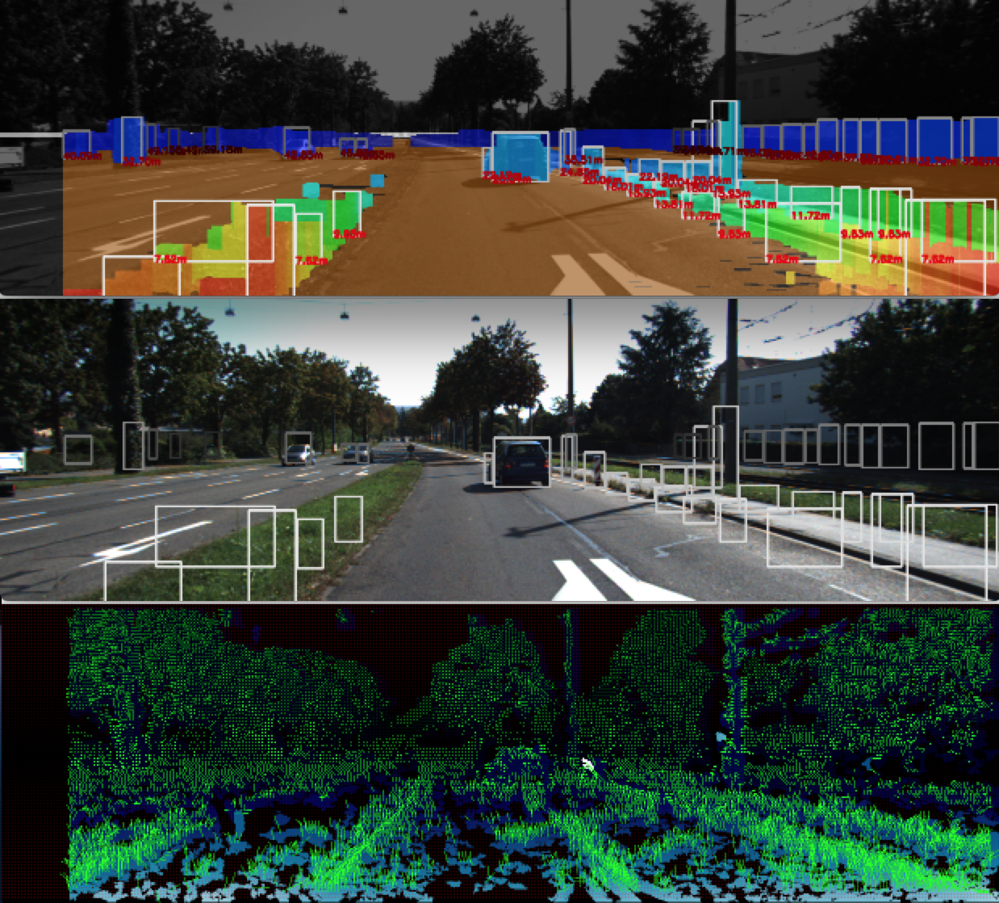
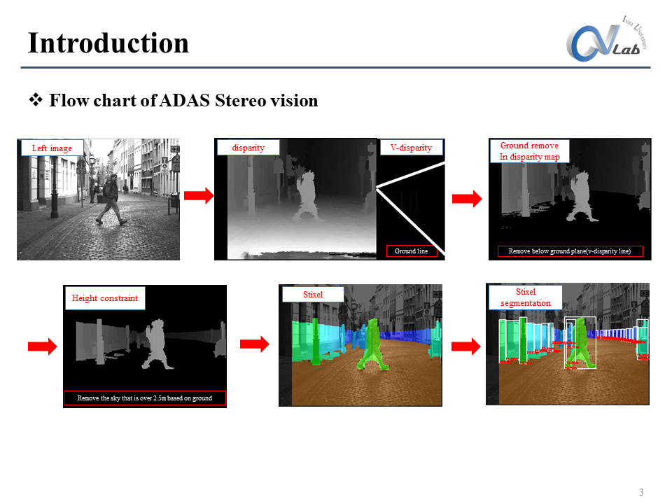
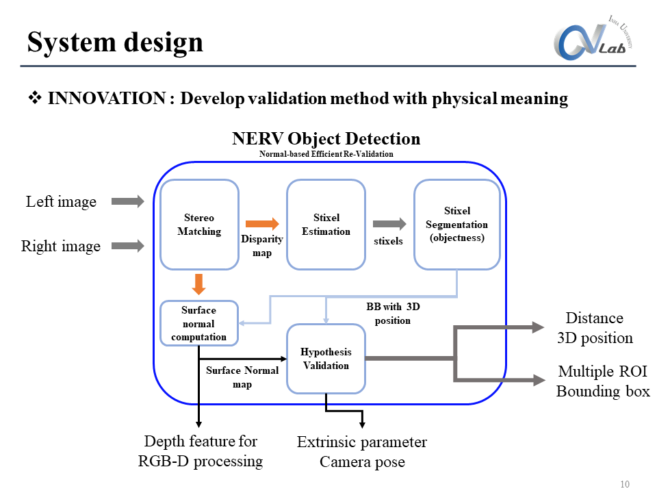
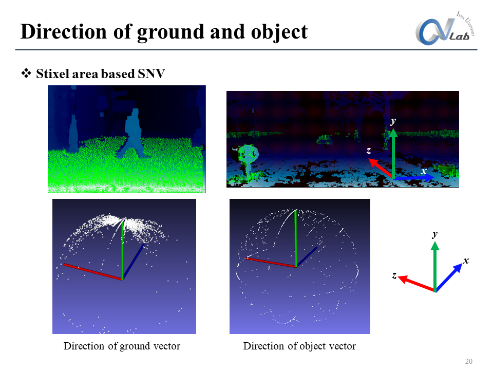

# Stereo vision for ADAS

Stereo vision for ADAS (unsupervised learning)
1. Stereo matching
2. Stixel estimation
3. Stixel segmentation(clustering), object detection
4. Surface Normal Vector estimation

Test on intel-core i7 desktop(cpu), processing time : **24ms/frame**

## Requirements

- C++ 11+
- OpenCV 2.4.9+, 3.0.0+
- OpenCV Extra (if you want to show 3D plot)
- pkg-config (mac, linux)
- cross platform(windows, osx, linux)

## Usage  

Input data (Test on KITTI data)

    └── data
        └── left
            └── 010%d.png (start from 0000000000.png)
        └── right
            └── 010%d.png

To test a code in osx or linux

    $ ./compile.sh
    $ g++ -o stereovisionforadas ./*.cpp `pkg-config --cflags --libs opencv` --std=c++11
    $ ./stereovisionforadas

To test a code in windows
- use visual studio, warning for opencv path (viz class)
- TBD

## Algorithm

### Result
Video : [3D visualization](https://youtu.be/y0BXYQKaXmU?t=5s)

Video : [Objectness, surface normal](https://youtu.be/8oB7MsPZG8c)

### Acknowledgement

This project working in CVLab. at Inha Univ.

http://vision.inha.ac.kr/
